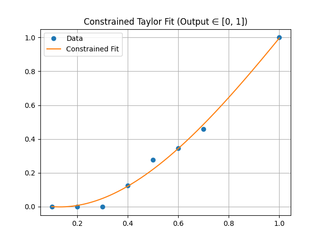
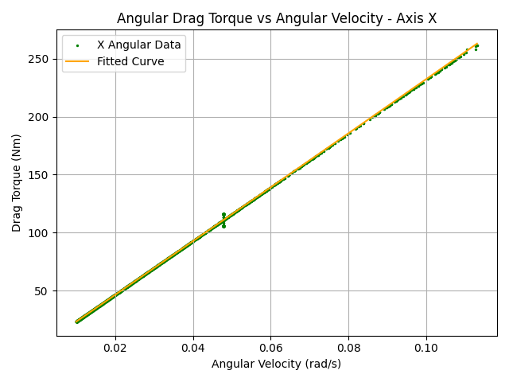
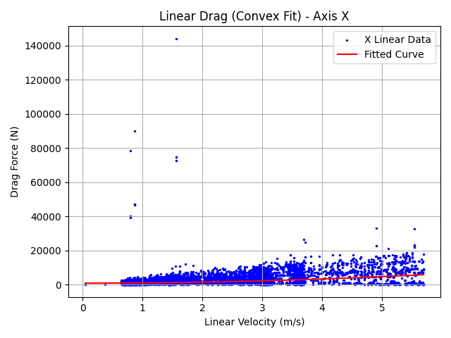
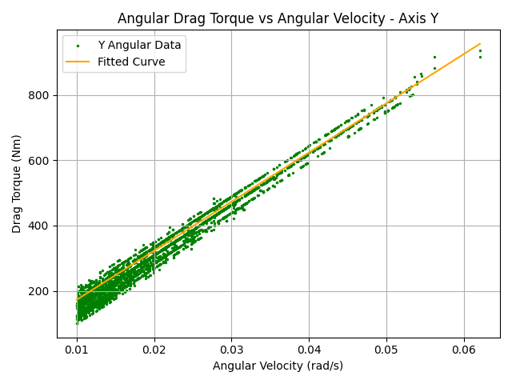
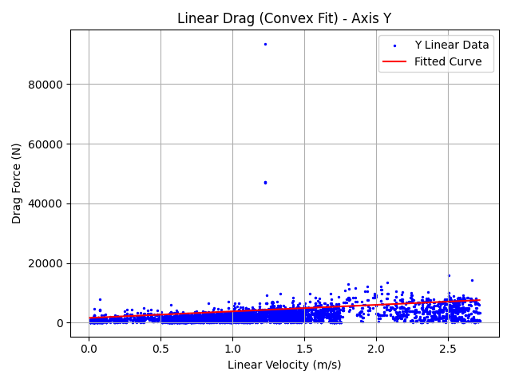
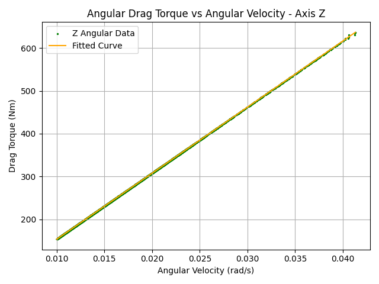
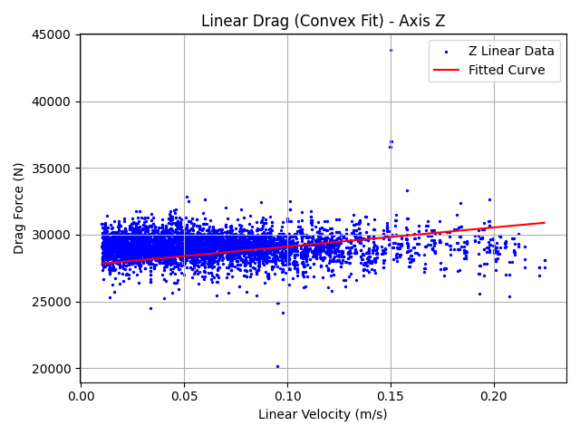

# 🛥️ USV Drag Estimator & Thruster Curve Fitting

This repository includes:

- **Drag Force/Torque Estimator** from ROS2 bag files (using acceleration/velocity and thrust estimation)
- **Thruster Performance Curve Estimator** using constrained Taylor series
- 📈 Automatic plotting of drag models for visualization and validation

---

## 📦 Features

### 1. Drag Force and Torque Estimator
Estimate the **convex** drag model with form:  
  **`F(v) = b + R·v + RR·v²`**  
for each axis **x, y, z** in both **linear** and **angular** space.

✅ Handles:
- ROS bag parsing  
- Unbalanced mass and inertia computation  
- Outlier removal and smoothing  
- Modular optimization pipeline  

### 2. Thruster Curve Estimator
Estimate the thrust from a **normalized input** using a **constrained Taylor fit** (output ∈ [0, 1]):

```python
from utils.taylor import constrained_taylor_fit

x = np.array([...])  # normalized input
y = np.array([...])  # observed velocity
coeffs, f_tuned = constrained_taylor_fit(x, y, degree=3, x0=0.0)
```

---

## 🛠️ Requirements

- Python ≥ 3.8
- ROS Noetic
- `numpy`, `matplotlib`, `scipy`, `glob`

---

## 🔧 Usage

### Step 1: Prepare Bag Files
Record and store `.bag` files in folders named like:

```
../bags/0402_1235/_2025-04-02-12-35-23_0.bag
```

### Step 2: Run Estimator

```bash
python3 main.py
```

You can change parameters inside the `config` dictionary to fit your setup:

```python
config = {
    "bag_list": [...],                    # list of rosbag paths
    "cmd_list": np.array([[0.5, 0.0], ...]),  # cmd_x and cmd_z pairs
    "cmd_to_force_func": cmd_to_force,   # callback to convert command to force
    "imu_topic": "/mavros/imu/data",
    "posestamp_topic": "/mavros/local_position/pose",
    "veh_mass": 2600.0,
    "veh_inertia": np.array([..., ..., ...]),
    "thrust_pose": np.array([...]),
}
```

---

## 🧪 Example Output

### 🔧 Drag Model Results

| Axis | Linear Drag Model        | Angular Drag Model       |
|------|---------------------------|---------------------------|
| X    | F = 0.0, S = 153.0285     | F = 2303.5096, S = 180.6183       |
| Y    | F = 2192.2172, S = 0.0      | F = 14995.8182, S = 803.4102       |
| Z    | F = 14288.8744, S = 0.0     | F = 15369.4673, S = 681.3849       |

### 🖼️ Visualization

#### Thruster Curve Fit


#### Drag Torque (X-axis)


#### Drag Force (X-axis)


#### Drag Torque (Y-axis)


#### Drag Force (Y-axis)


#### Drag Torque (Z-axis)


#### Drag Force (Z-axis)


---

## 🧩 Modules Explained

### `fit_force_axis(...)`
Handles drag parameter fitting with:
- Outlier filtering
- Convex fitting using `scipy.optimize.minimize`
- Returns optimal parameters `b, R, RR`

### `cmd_to_force(...)`
Converts a `[cmd_x, cmd_z]` input into force and torque vectors using a nonlinear motor map and physical thruster offset.

---

## 📚 Future Work

- [ ] Add support for negative thrust estimation  
- [ ] Use cmd topic streaming instead of list  
- [ ] Include wave estimation or filtering

---

Let me know if you'd like a Markdown version of this README or a `README.md` file generated directly.